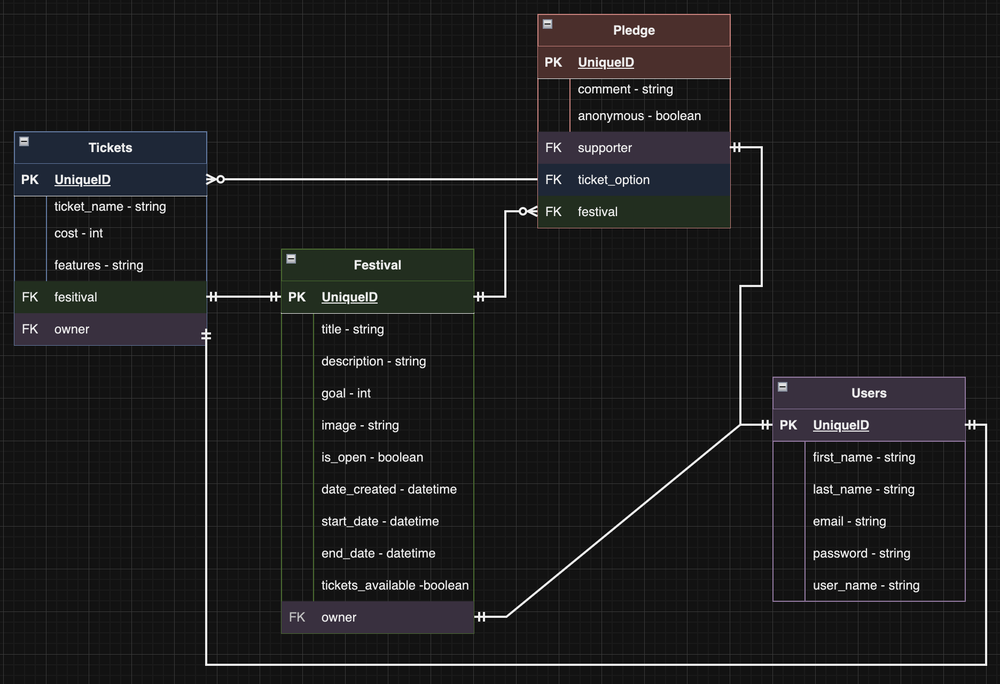

# FunderFest Events Back End
Back end repo for She Codes crowdfunding project. 

       

---
FIXME:
[About](#about) ✦ [API Spec](#api_spec) ✦ [DB Schema](#db_schema) ✦ [Resources](#resources) ✦ [License](#license) ✦ [Contact](#contact)

---
## About
### What is FunderFest
This project aim was to create a crowdfunding website. I decided to work with my events and festival background and create a platform for event creators. Funderfest Events allows event creators to sell tickets to their event with the oportunity to get donetions for the event as well. 

### Intended Audience/User Stories

### Front End Pages/Functionality

## API Spec
| URL                                    | HTTP Method | Purpose                                                  | Request Body | Success Response Code | Authentication/Authorisation              |
|----------------------------------------|-------------|----------------------------------------------------------|--------------|-----------------------|-------------------------------------------|
| /festivals/                            | GET         | List all festivals                                       |              | 200                   | None required                             |
| /festivals/                            | POST        | Festival object (without id or date created)             |              | 200                   | Log in required                           |
| /festivals/?is_open=True               | GET         | Return all festivals currently live                      |              | 200                   | None required                             |
| /festivals/?order_by=date_created      | GET         | Return festivals in order of date created                |              | 200                   | None required                             |
| /festivals/?order_by=number_of_pledges | GET         | Return festivals in order of number of pledges           |              | 200                   | None required                             |
| /festivals/?limit=x                    | GET         | Return the number of festivals by the value of x         |              | 200                   | None required                             |
| /festivals/?order_by=recent_pledges    | GET         | Return festivals in order of most recent pledges         |              | 200                   | None required                             |
| /festivals/1                           | GET         | Festivals with pledges field with list of pledge objects |              | 200                   | None required                             |
| /festivals/1                           | PUT         | Festival object (without id)                             |              | 200                   | Log in required and must be project owner |
| /pledges/                              | GET         | Return all pledges made                                  |              | 200                   | None required                             |
| /pledges/?order_by=date_created        | GET         | Return pledges in order of date created                  |              | 200                   | None required                             |
| /pledges/                              | POST        | Pledge object (without id or date created)               |              | 200                   | Log in required                           |
| /api-token-auth/                       | POST        | User object                                              |              | 200                   |                                           |
## DB Schema

---
## Resources
https://www.tablesgenerator.com

## License

This project is using the following license:

**MIT**

For further information regarding the license, please follow the link below:
https://opensource.org/licenses/MIT

---

## Contact

If you have any further questions, please contact via email or github.

 
